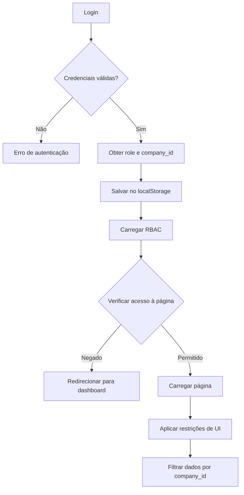

# 🔐 Sistema de Controle de Acesso (RBAC)

## Visão Geral

O sistema implementa controle de acesso baseado em roles (RBAC - Role-Based Access Control) com três níveis hierárquicos de permissões.

## Roles Disponíveis

### 1. 🟣 Super Administrador (superadmin)
- **Acesso**: Total irrestrito
- **Permissões**: 
  - Acesso a TODAS as empresas (cross-company)
  - Gestão completa de empresas
  - Todas as funcionalidades do admin
  - Não possui filtro de `company_id`
- **Páginas exclusivas**:
  - `empresas.html` - Gestão multi-empresa
- **Credenciais padrão**:
  - Usuário: `superadmin`
  - Senha: `super123`

### 2. 🔵 Administrador (admin)
- **Acesso**: Restrito à própria empresa
- **Permissões**:
  - Dashboard e relatórios
  - Gestão completa de pedidos, mesas, cardápio
  - Gestão de delivery e reservas
  - Controle de estoque e financeiro
  - Gestão de clientes
  - Gerenciamento de usuários (da própria empresa)
  - Configurações do sistema
- **Restrições**:
  - NÃO pode acessar `empresas.html`
  - Vê apenas dados da sua `company_id`
- **Credenciais padrão**:
  - Usuário: `admin`
  - Senha: `admin123`
  - Company ID: `1` (Maria Flor)

### 3. ⚪ Funcionário (staff)
- **Acesso**: Operações básicas
- **Permissões**:
  - Visualização do dashboard
  - Visualização e criação de pedidos
  - Visualização de mesas e cardápio
  - Visualização de delivery
- **Páginas bloqueadas**:
  - `usuarios.html`
  - `empresas.html`
  - `configuracoes.html`
  - `financeiro.html`
  - `estoque.html`
- **Credenciais padrão**:
  - Garçom: `garcom` / `garcom123`
  - Cozinha: `cozinha` / `cozinha123`
  - Caixa: `caixa` / `caixa123`

## Implementação Técnica

### Arquivos Principais

- **`js/rbac.js`**: Sistema principal de controle de acesso
- **`js/config.js`**: Definição de usuários e suas roles
- **`js/auth-neon.js`**: Sistema de autenticação (atualizado para incluir company_id)

### Fluxo de Verificação

```javascript
// 1. Auto-execução ao carregar página
document.addEventListener('DOMContentLoaded', () => {
    RBAC.checkPageAccess();    // Verifica se pode acessar a página
    RBAC.applyUIRestrictions(); // Oculta elementos não permitidos
});

// 2. Verificação manual em código
if (RBAC.isSuperAdmin()) {
    // Código exclusivo para superadmin
}

if (RBAC.isAdmin()) {
    // Código para admin ou superior
}

if (RBAC.hasPermission('pedidos.manage')) {
    // Código para quem tem permissão específica
}
```

### Filtragem de Dados

#### Para Superadmin (sem filtro)
```javascript
// Carrega TODOS os dados de TODAS as empresas
const dados = await API.getData();
// Resultado: [{id:1, company_id:1, ...}, {id:2, company_id:2, ...}]
```

#### Para Admin (com filtro automático)
```javascript
// Adiciona automaticamente company_id do usuário logado
const params = RBAC.addCompanyFilter({ status: 'active' });
// Resultado: { status: 'active', company_id: 1 }

const dados = await API.getData(params);
// Resultado: [{id:1, company_id:1, ...}] - apenas da empresa do admin
```

#### Filtro em Arrays
```javascript
// Filtra array existente
const todosDados = [...]; // Dados de múltiplas empresas
const dadosFiltrados = RBAC.filterByCompany(todosDados);
// Superadmin: retorna todos
// Admin: retorna apenas da sua company_id
```

## Uso nos Arquivos JS

### Proteção de Página Inteira

```javascript
// No início do arquivo JS (exemplo: empresas.js)
(function () {
  // 🔐 Verificação de acesso - Apenas superadmin
  if (typeof RBAC !== 'undefined' && !RBAC.isSuperAdmin()) {
    console.warn('⚠️ Acesso negado');
    RBAC.showAccessDeniedMessage();
    setTimeout(() => {
      window.location.href = 'dashboard.html';
    }, 2000);
    return;
  }
  
  // Resto do código...
})();
```

### Proteção de Funcionalidades Específicas

```javascript
// Exemplo: Botão de deletar apenas para admin
function renderButtons(item) {
  let html = '<button class="btn-view">Ver</button>';
  
  if (RBAC.isAdmin()) {
    html += '<button class="btn-edit">Editar</button>';
    html += '<button class="btn-delete">Excluir</button>';
  }
  
  return html;
}
```

### Filtragem de Dados na API

```javascript
// Exemplo: Carregar pedidos
async function loadOrders() {
  try {
    // Superadmin: sem filtro (vê todos)
    // Admin: adiciona company_id automaticamente
    const params = RBAC.addCompanyFilter({ status: 'pending' });
    
    const response = await API.orders.list(params);
    
    // Filtro adicional no frontend (caso necessário)
    const filteredOrders = RBAC.filterByCompany(response.data);
    
    renderOrders(filteredOrders);
  } catch (error) {
    console.error('Erro ao carregar pedidos:', error);
  }
}
```

## Configuração de Usuários

Edite `js/config.js` para adicionar/modificar usuários:

```javascript
USERS: {
  novoUsuario: {
    username: 'usuario',
    email: 'usuario@empresa.com',
    password: 'senha123',
    name: 'Nome do Usuário',
    role: 'admin', // ou 'superadmin', 'staff'
    company_id: 1, // ID da empresa (null para superadmin)
    permissions: [
      'dashboard.view',
      'pedidos.manage',
      // ... outras permissões
    ]
  }
}
```

## Estrutura de Permissões

### Formato: `modulo.acao`

- `dashboard.view` - Visualizar dashboard
- `pedidos.view` - Visualizar pedidos
- `pedidos.create` - Criar pedidos
- `pedidos.manage` - Gerenciar pedidos (criar, editar, deletar)
- `mesas.view` - Visualizar mesas
- `mesas.manage` - Gerenciar mesas
- `cardapio.view` - Visualizar cardápio
- `cardapio.manage` - Gerenciar cardápio
- `delivery.view` - Visualizar delivery
- `delivery.manage` - Gerenciar delivery
- `clientes.manage` - Gerenciar clientes
- `reservas.manage` - Gerenciar reservas
- `estoque.manage` - Gerenciar estoque
- `financeiro.view` - Visualizar financeiro
- `financeiro.manage` - Gerenciar financeiro
- `relatorios.view` - Visualizar relatórios
- `usuarios.manage` - Gerenciar usuários
- `configuracoes.manage` - Acessar configurações
- `all` - Todas as permissões (superadmin)

## Interface do Usuário

### Elementos Ocultos Automaticamente

O sistema automaticamente oculta:

1. **Link "Empresas" no menu lateral**: Apenas superadmin visualiza
2. **Links bloqueados para staff**: Usuários, Empresas, Configurações, Financeiro, Estoque
3. **Badge de role**: Exibe visualmente o nível de acesso do usuário

### Mensagens de Acesso Negado

Quando um usuário tenta acessar uma página sem permissão:

1. Mensagem de erro visual (notificação vermelha)
2. Redirecionamento automático para o dashboard após 2 segundos
3. Log no console para debug

## Debugging

### Console do Navegador

O sistema exibe informações de debug em localhost:

```javascript
// Visualizar informações do RBAC
RBAC.debugInfo();

// Output:
// 🔐 RBAC Debug Info
//   Usuário: Administrador Maria Flor
//   Role: admin
//   É Superadmin? false
//   É Admin? true
//   Company ID: 1
//   Permissões: ['dashboard.view', 'pedidos.manage', ...]
```

## Fluxo de Login



## Segurança

### Frontend
- ✅ Controle de acesso via JavaScript
- ✅ Ocultação de elementos não permitidos
- ✅ Redirecionamento automático em acesso negado
- ✅ Filtro de dados por company_id

### Backend (API)
- ✅ Validação de JWT com role
- ✅ Middleware de autenticação
- ✅ Middleware de autorização (requireRole)
- ✅ Filtro automático de company_id em queries
- ✅ Validação de propriedade dos dados

### Boas Práticas

1. **Nunca confie apenas no frontend**: Sempre validar no backend
2. **Use middleware de autorização**: `requireAuth` + `requireRole(['admin'])`
3. **Filtre queries por company_id**: Exceto para superadmin
4. **Valide propriedade**: Usuário só pode modificar dados da sua empresa
5. **Log de auditoria**: Registre ações sensíveis

## Exemplos Práticos

### Exemplo 1: Página de Pedidos

```javascript
// pedidos.js
async function loadOrders() {
  try {
    // Adiciona filtro de company_id automaticamente (exceto superadmin)
    const params = RBAC.addCompanyFilter({ 
      status: document.getElementById('filter-status').value 
    });
    
    const response = await API.orders.list(params);
    renderOrders(response.data);
  } catch (error) {
    showError('Erro ao carregar pedidos');
  }
}

// Botões condicionais
function renderOrderActions(order) {
  let html = '<button onclick="viewOrder(' + order.id + ')">Ver</button>';
  
  // Apenas admin pode editar e deletar
  if (RBAC.hasPermission('pedidos.manage')) {
    html += '<button onclick="editOrder(' + order.id + ')">Editar</button>';
    html += '<button onclick="deleteOrder(' + order.id + ')">Excluir</button>';
  }
  
  return html;
}
```

### Exemplo 2: Dashboard com Métricas

```javascript
// dashboard.js
async function loadDashboardStats() {
  // Superadmin: vê estatísticas de todas as empresas
  // Admin: vê apenas da sua empresa
  const params = RBAC.addCompanyFilter();
  
  const stats = await API.dashboard.getStats(params);
  
  // Exibe badge mostrando escopo dos dados
  const scopeText = RBAC.isSuperAdmin() 
    ? 'Todas as Empresas' 
    : 'Minha Empresa';
  
  document.getElementById('data-scope').textContent = scopeText;
  renderStats(stats);
}
```

### Exemplo 3: Gestão de Usuários

```javascript
// usuarios.js
async function loadUsers() {
  // Admin vê apenas usuários da sua empresa
  // Superadmin vê todos
  const params = RBAC.addCompanyFilter();
  const users = await API.users.list(params);
  
  // Ocultar botão de criar superadmin para não-superadmins
  if (!RBAC.isSuperAdmin()) {
    document.getElementById('btn-create-superadmin').style.display = 'none';
  }
  
  renderUsers(users);
}
```

## Troubleshooting

### Problema: Usuário não consegue acessar página
**Solução**: Verificar se o role está correto e se a página não está na lista de bloqueios

### Problema: Admin vê dados de outras empresas
**Solução**: Verificar se `RBAC.addCompanyFilter()` está sendo usado nas requisições

### Problema: Link "Empresas" aparece para admin
**Solução**: Verificar se `rbac.js` está sendo carregado corretamente após `auth-neon.js`

### Problema: Badge de role não aparece
**Solução**: Verificar se existe elemento com classe `.user-info`, `.header-user` ou `.current-user` no header

## Changelog

- **v2.2.0** (Janeiro 2026): Sistema RBAC completo implementado
  - 3 níveis de acesso (superadmin, admin, staff)
  - Filtro automático por company_id
  - Proteção de páginas e funcionalidades
  - Ocultação automática de elementos não permitidos
  - Badges visuais de role

## Suporte

Para dúvidas ou problemas:
1. Verifique o console do navegador (F12)
2. Execute `RBAC.debugInfo()` para ver configurações atuais
3. Revise os logs do servidor para erros de autorização
4. Consulte a documentação da API em `README.md`

---

**Importante**: Este sistema de RBAC é uma implementação frontend + backend. Para segurança completa, sempre valide as permissões também no servidor (API).
